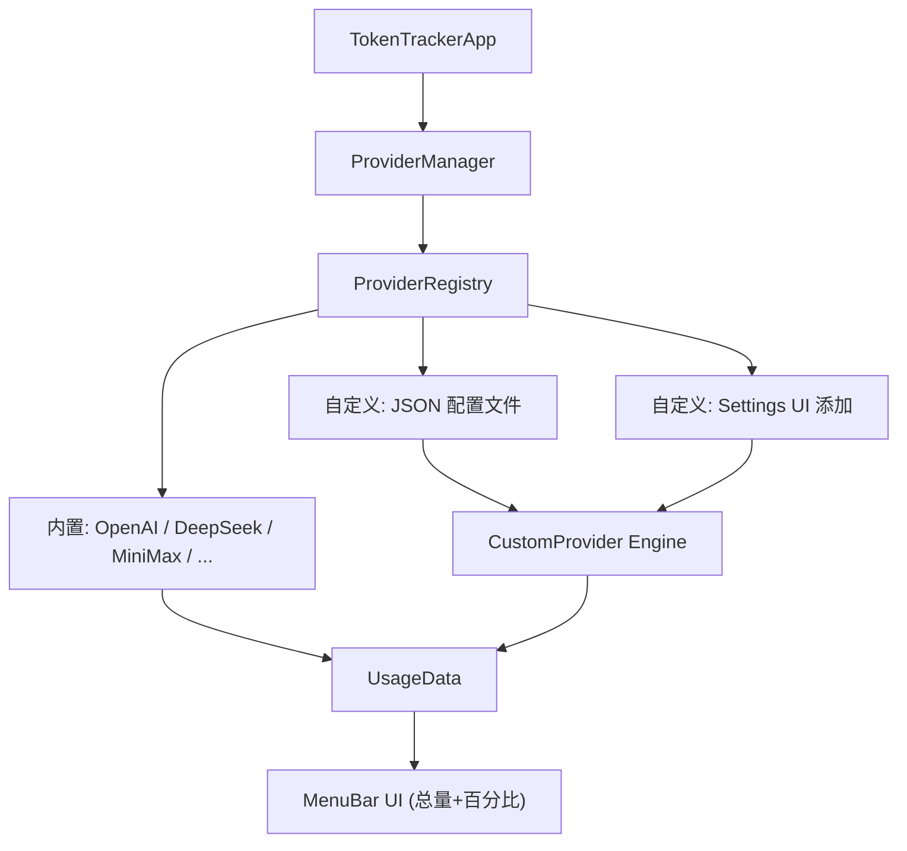

# TokenTracker — macOS Menu Bar Token Usage Dashboard

Build a native macOS menu bar app using **SwiftUI + MenuBarExtra** that connects to multiple AI API platforms and displays aggregated token usage. **插件式架构 + 配置驱动**，通过 UI 或配置文件即可新增平台，无需改代码。

## 核心设计：配置驱动的 Provider 架构



### 添加新 Provider 的两种方式

**方式一：Settings UI 表单（推荐）**
在 Settings → "Add Custom Provider" 中填写：
- 名称、图标、颜色
- API 端点 URL、请求方法
- 认证方式（Bearer Token / API Key Header）
- 响应中提取余额/用量的 JSON Key Path

**方式二：JSON 配置文件**
将 JSON 文件放入 `~/.config/tokentracker/providers/` 目录：
```json
{
  "id": "my-new-platform",
  "displayName": "My Platform",
  "iconName": "cloud",
  "brandColorHex": "#FF6B6B",
  "providerType": "custom",
  "endpointConfig": {
    "baseURL": "https://api.example.com",
    "path": "/v1/user/balance",
    "method": "GET",
    "authType": "bearer",
    "authHeader": "Authorization",
    "authPrefix": "Bearer ",
    "balanceKeyPath": "data.total_balance",
    "remainingKeyPath": "data.available_balance",
    "currency": "USD"
  }
}
```
App 启动时自动加载，无需重新编译。

## 初始支持平台

| Platform | 查询方式 | API Endpoint |
|----------|---------|--------------|
| **OpenAI** | ✅ 自动 (Admin Key) | `GET /v1/organization/usage/completions` |
| **DeepSeek** | ✅ 自动 (余额查询) | `GET /user/balance` |
| **MiniMax** | ✅ 自动 (余额查询) | Balance API |
| **Anthropic** | 📝 手动输入 | 无公开 API |
| **Google Gemini** | 📝 手动输入 | 无公开 API |
| **自定义** | ⚙️ 配置驱动 | 用户自定义 URL |

## 项目结构

```
TokenTracker/
├── TokenTrackerApp.swift              # MenuBarExtra 入口
├── Models/
│   ├── UsageData.swift                # 统一用量模型（含总量+百分比）
│   └── ProviderConfig.swift           # Provider 配置（含 EndpointConfig）
├── Providers/
│   ├── UsageProvider.swift            # Protocol
│   ├── ProviderRegistry.swift         # 注册表（内置 + 自定义配置加载）
│   ├── OpenAIProvider.swift
│   ├── DeepSeekProvider.swift
│   ├── MiniMaxProvider.swift
│   ├── AnthropicProvider.swift        # 手动输入
│   ├── GeminiProvider.swift           # 手动输入
│   └── CustomProvider.swift           # ⭐ 通用引擎，执行配置驱动的 API 调用
├── ViewModels/
│   └── TokenTrackerViewModel.swift
├── Views/
│   ├── MenuBarView.swift              # 主弹出面板
│   ├── ProviderCardView.swift         # 单个平台卡片（含进度条）
│   ├── SettingsView.swift             # 设置页
│   └── AddProviderView.swift          # ⭐ 新增自定义 Provider 表单
├── Storage/
│   ├── KeychainHelper.swift           # Keychain 存储 API Key
│   └── ConfigFileManager.swift        # ⭐ 加载/保存 JSON 配置文件
└── Utilities/
    └── Extensions.swift
```

## UI 设计

```
┌──────────────────────────────────┐
│  🔥 TokenTracker     Today ▼   │
│  Total: $45.20 | 12.5M tokens  │
├──────────────────────────────────┤
│  🟢 OpenAI           $32.10    │
│    Input: 8.2M  Output: 2.1M   │
│    ████████████░░░ 78.5%        │
│    ▸ gpt-4o: $28.00            │
│  🔵 DeepSeek         ¥42.00    │
│    ████░░░░░░░░░░░ 28.0%        │
│    Remaining: ¥108.00           │
│  🟣 MiniMax          ¥15.00    │
│    ██░░░░░░░░░░░░░ 15.0%        │
│  🟠 Anthropic        $9.60     │
│    (手动输入)                    │
├──────────────────────────────────┤
│  ↻ 11:05 AM        ⚙ Settings  │
└──────────────────────────────────┘
```

每个卡片显示：用量金额、Input/Output token 数、**总额度进度条 + 百分比**、剩余余额。

## Settings UI

```
┌─ Settings ──────────────────────┐
│ Providers         General       │
├─────────┬───────────────────────┤
│ ● OpenAI  🟢 │ OpenAI          │
│ ● DeepSeek🟢 │                 │
│ ● MiniMax ⚪ │ API Key:        │
│ ● Anthro  ⚪ │ [••••••••••] 👁  │
│ ● Gemini  ⚪ │                 │
│             │ [Test Connection]│
│             │ Status: ✓ 已连接  │
│             │                 │
│ [+ 添加自定义] │                 │
└─────────┴───────────────────────┘
```

General tab:
```
┌─ Settings ──────────────────────┐
│ Providers         General       │
├─────────────────────────────────┤
│ 轮询间隔:  [5 分钟 ▼]           │
│   (1分钟/5分钟/15分钟/30分钟/1小时)│
│ 开机启动:  [✓]                  │
└─────────────────────────────────┘
```

## Add Custom Provider UI

```
┌─ 添加自定义 Provider ────────────┐
│ 名称:   [             ]        │
│ 图标:   [cloud ▼]  颜色: [■]   │
│─── API 配置 ───────────────────│
│ URL:    [https://api.xxx.com]  │
│ 路径:   [/v1/user/balance   ]  │
│ 方法:   (● GET) (○ POST)       │
│ 认证:   [Bearer Token ▼]       │
│─── 响应映射 ───────────────────│
│ 余额字段:  [data.total_balance]│
│ 剩余字段:  [data.remaining  ]  │
│ 货币:     [CNY ▼]              │
│                                │
│       [取消]    [添加]          │
└────────────────────────────────┘
```

## Verification Plan

1. `xcodebuild` 编译验证
2. 运行 app → 验证菜单栏图标出现
3. Settings → 配置 API Key → 验证数据获取
4. Settings → Add Custom Provider → 填写表单 → 验证自定义平台出现并工作
5. 将 JSON 配置文件放入 `~/.config/tokentracker/providers/` → 重启 app → 验证自动加载
